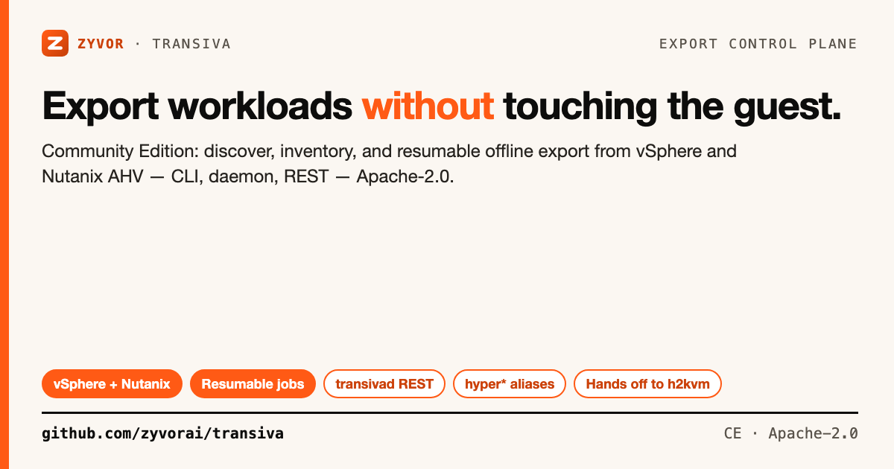
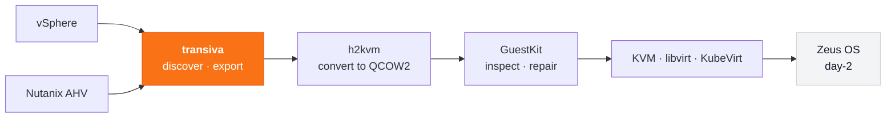

# Transiva — Community Edition

[](https://github.com/zyvorai/transiva/actions/workflows/ci.yml)
[](https://github.com/zyvorai/transiva/tags)
[](https://go.dev/)
[](https://www.apache.org/licenses/LICENSE-2.0)



**Enterprise workload mobility starts with honest offline export.**

Transiva Community Edition is a Go control plane that discovers, inventories, and orchestrates workload exports from VMware vSphere and Nutanix AHV, handing artifacts to [hyper2kvm](https://github.com/zyvorai/h2kvm) for conversion. Fleet jobs run over REST and CLI — **Apache-2.0**, no guest agent, source VM untouched until cutover.

📖 **[Platform docs](https://zyvor.dev/docs/transiva-platform?utm_source=github&utm_medium=transiva)** · **[Nutanix guide](docs/nutanix.md)** · **[OpenAPI](openapi.yaml)** · Walkthroughs on **[zyvor.dev/demo](https://zyvor.dev/demo?utm_source=github&utm_medium=transiva&utm_campaign=readme_demos)** (some recordings still say “HyperSDK” in the title).

Day-2 on **[Zeus OS](https://zyvor.dev/zeus-os)** · [Talk to an engineer](https://zyvor.dev/schedule?utm_source=github&utm_medium=transiva&utm_campaign=readme_hero) · [30-day PoC](https://zyvor.dev/poc?utm_source=github&utm_medium=transiva&utm_campaign=readme_hero)

## Contents

- [The renewal trap](#the-renewal-trap--escaped-with-an-api)
- [60-second quick start](#60-second-quick-start)
- [Where this fits](#where-this-fits-the-zyvor-suite)
- [Community Edition vs Platform](#community-edition-vs-transiva-platform)
- [Development](#development)
- [Support](#support-the-project)
- [License](#license)

## The renewal trap — escaped with an API

Every hypervisor renewal buries your VMs deeper in someone else’s proprietary API. Getting out usually means a spreadsheet, a maintenance window, and a pile of one-off `ovftool` invocations.

**Transiva turns that into a job.**

```text
  vSphere · Nutanix AHV
           │
           ▼
  ┌────────────────────────────────────────┐
  │  Transiva (Community)                  │──►  discover · inventory · export
  │  transivactl  (compat: hyperctl)       │──►  resumable jobs · REST
  │  transivad    (compat: hypervisord)    │──►  artifacts for h2kvm
  └────────────────────────────────────────┘
           │
           ▼
  h2kvm → GuestKit → KVM / KubeVirt → Zeus OS
```

| | | |
|:---:|:---:|:---:|
| **2** source hypervisors (CE) | **1** workflow for both | **0** guest agents |
| Apache-2.0 | CLI + REST | Offline export — source VM untouched |

**Export with Transiva → convert with [hyper2kvm](https://github.com/zyvorai/h2kvm) → assure with [GuestKit](https://github.com/zyvorai/guestkit) → operate on [Zeus OS](https://zyvor.dev/zeus-os).**

> **Maturity (honest):** CE covers **two sources** and **full exports** (no CBT, no multi-provider dashboard). Ten-plus providers, waves, SSO, and cutover-night support are **Transiva Platform** — [feature matrix](docs/ce-vs-enterprise.md).

## Why teams start here

| Before one-off scripts | With Transiva CE |
|-----------------|----------------|
| `ovftool` one-offs and tribal scripts | One CLI + job model for vSphere **and** Nutanix |
| Spreadsheet of VMs nobody trusts | `transivactl list` / `export` (compat: `hyperctl`) |
| Export fails mid-transfer — start over | Resumable jobs via `transivad` + REST |
| Conversion mutates the live guest | Offline artifacts — source VM untouched until cutover |
| No path to KubeVirt / Zeus OS | Clean handoff into the Zyvor suite |

- **Two sources, one workflow.** vSphere and Nutanix AHV behave identically — same CLI, same jobs, same output layout.
- **Scriptable end to end.** Interactive CLI for one-offs; daemon + REST for fleets.
- **Open by default.** Apache-2.0, no phone-home, no agent in the guest. Source, Docker, RPMs.

---

## 60-second quick start

<details open>
<summary><b>VMware vSphere</b></summary>

```bash
git clone https://github.com/zyvorai/transiva.git
cd transiva
./scripts/build.sh

cp config.example.yaml config.yaml
# edit config.yaml for your vSphere endpoint
./bin/hyperexport --config config.yaml
```

</details>

<details>
<summary><b>Nutanix AHV</b></summary>

```bash
cp config.example.yaml config.yaml
# configure nutanix.host, credentials, and nutanix.mounts (NFS container paths)

./bin/hypervisord --config config.yaml

hyperctl list --provider nutanix
hyperctl export --provider nutanix --vm web-prod-01 \
  --output /var/lib/transiva/nutanix \
  --mounts 'default-container:/mnt/nutanix/default'
```

Full walkthrough: **[docs/nutanix.md](docs/nutanix.md)**

</details>

<details>
<summary><b>Daemon + REST</b></summary>

```bash
./bin/hypervisord --config config.yaml
./bin/hyperctl status
```

REST surface: [openapi.yaml](openapi.yaml) · containers: [deployments/docker/](deployments/docker/)

</details>

### Binaries

| Binary | Role |
|--------|------|
| `transivaexport` (compat: `hyperexport`) | Interactive CLI exports (vSphere, Nutanix, …) |
| `transivad` (compat: `hypervisord`) | REST API daemon |
| `transivactl` (compat: `hyperctl`) | Job control — `list`, `export`, `info`, `submit` |
| `nutanix-pickup` | Standalone Nutanix discovery/pickup |

> Legacy `hyper*` binaries remain compatibility aliases for at least one major release.

---

## Where this fits: the Zyvor suite



| Stage | Tool | What it does |
|---|---|---|
| **Export** | **transiva** *(this repo)* | Discover via provider API, export disks + metadata |
| Convert | [h2kvm](https://github.com/zyvorai/h2kvm) | Rewrite to QCOW2 offline, fix drivers before first boot |
| Assure | [GuestKit](https://github.com/zyvorai/guestkit) | Offline doctor score + Passport before power-on |
| Host | [Machina](https://zyvor.dev/machina) | Bare-metal KVM / libvirt on the hypervisor host |
| Operate | [Zeus OS](https://zyvor.dev/zeus-os) | VMs + containers — KubeVirt lifecycle, GPU, multi-cluster |

Methodology: **Discover → Assess → Convert → Deploy → Operate → Optimize.** This repo covers discover + export in CE. [Full hypervisor-exit route →](https://zyvor.dev/hypervisor-exit?utm_source=github&utm_medium=transiva&utm_campaign=readme_suite)

---

## Community Edition vs Transiva Platform

**CE proves export. Platform runs the hypervisor-exit program.**

CE is free forever for labs — two sources, CLI, GitHub Issues. If you are moving an estate: no CBT, no waves, no SSO, no named owner on cutover night. **Buy Platform.**

| | **Community Edition** *(this repo)* | **[Transiva Platform](https://zyvor.dev/transiva?utm_source=github&utm_medium=transiva&utm_campaign=readme_table)** |
|---|---|---|
| **Who it is for** | Labs · PoC · single-host | Platform / SRE leads · **50–10,000+ VMs** |
| **Sources** | vSphere, Nutanix AHV | **10–11 providers** — Hyper-V, AWS, Azure, GCP, OCI, OpenStack, Proxmox, KubeVirt, … |
| **Interface** | CLI + REST daemon | **Dashboard** · Spotlight · noVNC · SDKs · 200–267+ routes |
| **Incremental** | Full exports only | **CBT** + smart fallback — windows that fit change freeze |
| **Pipeline** | Hand off to h2kvm yourself | Wizard · **17 readiness checks** · waves · approvals · blackouts |
| **Deploy targets** | Local output → h2kvm | Glance/Nova · libvirt · **KubeVirt** · live libvirt→KubeVirt |
| **Security** | Config-file credentials | Vault · **SSO/OIDC/SAML** · RBAC · audit · air-gap packs |
| **Ops** | Single-node eval | Multi-tenant CP · HA · agents · carbon/chargeback · compliance |
| **Day-2** | Hand off to Zeus OS | Licensed **Zeus OS** suite path |
| **Support** | [GitHub Issues](https://github.com/zyvorai/transiva/issues) | **SLA** · workshops · hypervisor-exit PS |

### Why teams upgrade

1. Full-export weekends do not survive a multi-wave estate  
2. Security needs SSO, vaulted secrets, and an audit stream  
3. Executives need wave plans — not CLI screenshots  
4. CBT shrinks the cutover window into change freeze  
5. You need Zyvor on the bridge — not Issues at 2 a.m.  

**[Full feature matrix →](docs/ce-vs-enterprise.md)** · [enterprise.md](docs/enterprise.md)

**Bring us your worst estate.** [30-day PoC](https://zyvor.dev/poc?utm_source=github&utm_medium=transiva&utm_campaign=readme_footer) · [Platform demo](https://zyvor.dev/contact?intent=demo&utm_source=github&utm_medium=transiva&utm_campaign=readme_footer) · [Pricing](https://zyvor.dev/pricing?utm_source=github&utm_medium=transiva&utm_campaign=readme_footer)

---

## Development

```bash
make test
make lint
```

PRs welcome. Security reports → [SECURITY.md](SECURITY.md).

## Support the project

Transiva Community Edition is free and open source, maintained by **Susant Sahani** at [Zyvor AI Labs](https://zyvor.dev?utm_source=github&utm_medium=transiva&utm_campaign=readme_support).

If it saved you a licence renewal, a ⭐ helps more people find it.

| | |
|---|---|
| **Production / Platform** | [Talk to an engineer](https://zyvor.dev/schedule?utm_source=github&utm_medium=transiva) · [sales@zyvor.dev](mailto:sales@zyvor.dev) |
| **Community** | [GitHub Issues](https://github.com/zyvorai/transiva/issues) |
| **General** | [info@zyvor.dev](mailto:info@zyvor.dev) |

Social assets: [docs/social/](docs/social/).

## Related open-source repos

| Repo | Role |
|---|---|
| [h2kvm](https://github.com/zyvorai/h2kvm) | Convert exported disks → KVM |
| [guestkit](https://github.com/zyvorai/guestkit) | Offline disk doctor + Passport |
| [chimera](https://github.com/zyvorai/chimera) | Infrastructure simulation for export CI |
| [netevd](https://github.com/zyvorai/netevd) | Real-time network event tracking |

[Browse all open-source →](https://zyvor.dev/about#support-open-source)

## License

### Open source (Apache-2.0)

This repository is licensed under the [Apache License, Version 2.0](LICENSE).
You may use, modify, and run it for personal, lab, and commercial production
use at no charge, subject to Apache-2.0 (preserve notices / NOTICE where required).

### Enterprise

Production support, SLAs, and Zyvor Enterprise products are licensed separately.
Contact [sales@zyvor.dev](mailto:sales@zyvor.dev) or see [zyvor.dev](https://zyvor.dev).
