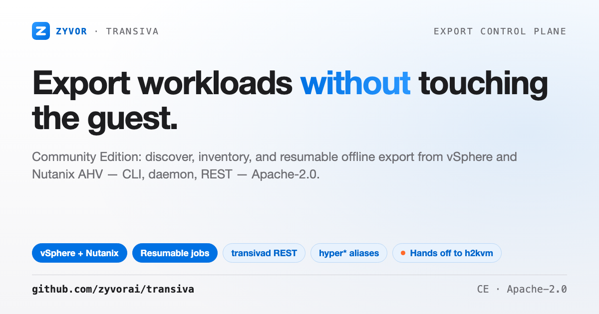

<div align="center">

<picture>
  <source media="(prefers-color-scheme: dark)" srcset="docs/social/transiva-share-card-dark.png">
  
</picture>

# Transiva — Community Edition

### Enterprise workload mobility starts with honest offline export.

Transiva Community Edition is a Go control plane that discovers, inventories, and orchestrates workload exports from VMware vSphere and Nutanix AHV, handing artifacts to [hyper2kvm](https://github.com/zyvorai/h2kvm) for conversion.<br>
Fleet jobs run over REST and CLI — **Apache-2.0**, no guest agent, source VM untouched until cutover.

[](https://github.com/zyvorai/transiva/actions/workflows/ci.yml)
[](https://github.com/zyvorai/transiva/tags)
[](https://go.dev/)
[](https://www.apache.org/licenses/LICENSE-2.0)

[**Quick start**](#60-second-quick-start) · [**Platform docs**](https://zyvor.dev/docs/transiva-platform?utm_source=github&utm_medium=transiva) · [**Nutanix guide**](docs/nutanix.md) · [**OpenAPI**](openapi.yaml) · [**Community vs Platform**](#community-edition-vs-transiva-platform) · [**Talk to an engineer**](https://zyvor.dev/schedule?utm_source=github&utm_medium=transiva&utm_campaign=readme_hero)

</div>

---

## The renewal trap — escaped with an API

Every hypervisor renewal buries your VMs deeper in someone else’s proprietary API. Getting out usually means a spreadsheet, a maintenance window, and a pile of one-off `ovftool` invocations. **Transiva turns that into a job.**

<div align="center">

| **2** source hypervisors (CE) | **1** workflow for both | **0** guest agents |
|:---:|:---:|:---:|
| Apache-2.0 | CLI + REST | Offline export — source VM untouched |

**Export with Transiva → convert with [hyper2kvm](https://github.com/zyvorai/h2kvm) → assure with [GuestKit](https://github.com/zyvorai/guestkit) → operate on [Zeus OS](https://zyvor.dev/zeus-os) or the open-source [Zorvia](https://github.com/zyvorai/zorvia/blob/main/docs/leave-openshift.md).** Each is a separate tool; Zorvia's own importer is Experimental.

</div>

<table>
<tr>
<td valign="top" width="33%">
<b>Discover and inventory</b><br>
Discover via the provider API and inventory workloads before you export anything.<br>
<a href="docs/renewal-trap.md">The renewal trap</a>
</td>
<td valign="top" width="33%">
<b>Resumable exports</b><br>
Export fails mid-transfer? Resumable jobs via <code>transivad</code> and REST, not a restart from zero.<br>
<a href="docs/quick-start.md">Quick start</a>
</td>
<td valign="top" width="33%">
<b>Two sources, one workflow</b><br>
vSphere and Nutanix AHV behave identically: same CLI, same jobs, same output layout.<br>
<a href="docs/nutanix.md">Nutanix guide</a>
</td>
</tr>
<tr>
<td valign="top" width="33%">
<b>Offline, no guest agent</b><br>
Offline artifacts; the source VM is untouched until cutover.<br>
<a href="docs/renewal-trap.md">Why teams start here</a>
</td>
<td valign="top" width="33%">
<b>Scriptable end to end</b><br>
Interactive CLI for one-offs; daemon plus REST for fleets. Source, Docker and RPMs.<br>
<a href="openapi.yaml">OpenAPI</a>
</td>
<td valign="top" width="33%">
<b>Clean handoff</b><br>
Artifacts flow into h2kvm and GuestKit, then KVM, KubeVirt and Zeus OS.<br>
<a href="docs/suite-fit.md">Where it fits</a>
</td>
</tr>
</table>

> **Maturity (honest):** CE covers **two sources** and **full exports** (no CBT, no multi-provider dashboard). Ten-plus providers, waves, SSO, and cutover-night support are **Transiva Platform** — [feature matrix](docs/ce-vs-enterprise.md).

<a id="why-teams-start-here"></a>

---

## 60-second quick start

```bash
git clone https://github.com/zyvorai/transiva.git
cd transiva
./scripts/build.sh

cp config.example.yaml config.yaml
# edit config.yaml for your vSphere endpoint
./bin/hyperexport --config config.yaml
```

Nutanix AHV, the daemon and REST API, and the binaries table are in **[docs/quick-start.md](docs/quick-start.md)**; the Nutanix walkthrough is **[docs/nutanix.md](docs/nutanix.md)**. Legacy `hyper*` binaries remain compatibility aliases for at least one major release.

<a id="binaries"></a>

---

## Where this fits: the Zyvor suite

**transiva** (discover · export) → **[h2kvm](https://github.com/zyvorai/h2kvm)** (convert to QCOW2) → **[GuestKit](https://github.com/zyvorai/guestkit)** (inspect · repair) → KVM · libvirt · KubeVirt → **[Zeus OS](https://zyvor.dev/zeus-os)** (day-2).

Methodology: **Discover → Assess → Convert → Deploy → Operate → Optimize.** This repo covers discover + export in CE. [Full hypervisor-exit route →](https://zyvor.dev/hypervisor-exit?utm_source=github&utm_medium=transiva&utm_campaign=readme_suite) · The diagram and stage table: [docs/suite-fit.md](docs/suite-fit.md).

---

## Community Edition vs Transiva Platform

**CE proves export. Platform runs the hypervisor-exit program.**

CE is free forever for labs — two sources, CLI, GitHub Issues. If you are moving an estate: no CBT, no waves, no SSO, no named owner on cutover night. **Buy Platform.**

| | **Community Edition** *(this repo)* | **[Transiva Platform](https://zyvor.dev/transiva?utm_source=github&utm_medium=transiva&utm_campaign=readme_table)** |
|---|---|---|
| **Who it is for** | Labs · PoC · single-host | Platform / SRE leads · **50–10,000+ VMs** |
| **Sources** | vSphere, Nutanix AHV | **10–11 providers** — Hyper-V, AWS, Azure, GCP, OCI, OpenStack, Proxmox, KubeVirt, … |
| **Incremental** | Full exports only | **CBT** + smart fallback — windows that fit change freeze |
| **Security** | Config-file credentials | Vault · **SSO/OIDC/SAML** · RBAC · audit · air-gap packs |
| **Support** | [GitHub Issues](https://github.com/zyvorai/transiva/issues) | **SLA** · workshops · hypervisor-exit PS |

<a id="why-teams-upgrade"></a>**[Full feature matrix →](docs/ce-vs-enterprise.md)** · [enterprise.md](docs/enterprise.md) · The whole table and why teams upgrade: [docs/community-vs-platform.md](docs/community-vs-platform.md)

**Bring us your worst estate.** [30-day PoC](https://zyvor.dev/poc?utm_source=github&utm_medium=transiva&utm_campaign=readme_footer) · [Platform demo](https://zyvor.dev/contact?intent=demo&utm_source=github&utm_medium=transiva&utm_campaign=readme_footer) · [Pricing](https://zyvor.dev/pricing?utm_source=github&utm_medium=transiva&utm_campaign=readme_footer)

---

## Development

```bash
make test
make lint
```

PRs welcome. Security reports → [SECURITY.md](SECURITY.md).

## Support the project

Transiva Community Edition is free and open source, maintained by **Susant Sahani** at [Zyvor AI Labs](https://zyvor.dev?utm_source=github&utm_medium=transiva&utm_campaign=readme_support).

| | |
|---|---|
| **Production / Platform** | [Talk to an engineer](https://zyvor.dev/schedule?utm_source=github&utm_medium=transiva) · [sales@zyvor.dev](mailto:sales@zyvor.dev) |
| **Community** | [GitHub Issues](https://github.com/zyvorai/transiva/issues) |
| **General** | [info@zyvor.dev](mailto:info@zyvor.dev) |

<a id="related-open-source-repos"></a>Related repositories (h2kvm, guestkit, chimera, netevd), social assets and more: [docs/support-and-related.md](docs/support-and-related.md).

## Documentation

| Topic | Doc |
|---|---|
| Every page, in one list | [docs/documentation-map.md](docs/documentation-map.md) |
| Quick start, binaries, Nutanix | [docs/quick-start.md](docs/quick-start.md) · [docs/nutanix.md](docs/nutanix.md) |
| The renewal trap and why teams start here | [docs/renewal-trap.md](docs/renewal-trap.md) |
| Where Transiva fits in the Zyvor suite | [docs/suite-fit.md](docs/suite-fit.md) |
| Community Edition vs Platform | [docs/community-vs-platform.md](docs/community-vs-platform.md) · [docs/ce-vs-enterprise.md](docs/ce-vs-enterprise.md) · [docs/enterprise.md](docs/enterprise.md) |
| REST API | [openapi.yaml](openapi.yaml) |

## License

### Open source (Apache-2.0)

This repository is licensed under the [Apache License, Version 2.0](LICENSE).
You may use, modify, and run it for personal, lab, and commercial production
use at no charge, subject to Apache-2.0 (preserve notices / NOTICE where required).

### Enterprise

Production support, SLAs, and Zyvor Enterprise products are licensed separately.
Contact [sales@zyvor.dev](mailto:sales@zyvor.dev) or see [zyvor.dev](https://zyvor.dev).
