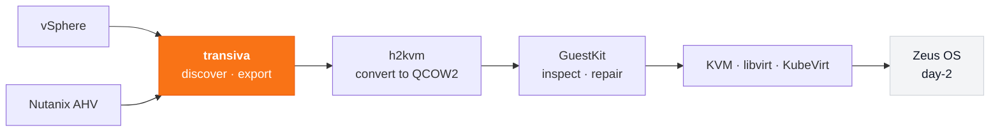

# Where Transiva fits in the Zyvor suite

How exports flow through h2kvm and GuestKit to KVM, KubeVirt and Zeus OS.

[Back to the README](../README.md)

---

## Where this fits: the Zyvor suite

| Stage | Tool | What it does |
|---|---|---|
| **Export** | **transiva** *(this repo)* | Discover via provider API, export disks + metadata |
| Convert | [h2kvm](https://github.com/zyvorai/h2kvm) | Rewrite to QCOW2 offline, fix drivers before first boot |
| Assure | [GuestKit](https://github.com/zyvorai/guestkit) | Offline doctor score + Passport before power-on |
| Host | [Machina](https://zyvor.dev/machina) | Bare-metal KVM / libvirt on the hypervisor host |
| Operate | [Zeus OS](https://zyvor.dev/zeus-os) | VMs + containers — KubeVirt lifecycle, GPU, multi-cluster |

Methodology: **Discover → Assess → Convert → Deploy → Operate → Optimize.** This repo covers discover + export in CE. [Full hypervisor-exit route →](https://zyvor.dev/hypervisor-exit?utm_source=github&utm_medium=transiva&utm_campaign=readme_suite)

---
